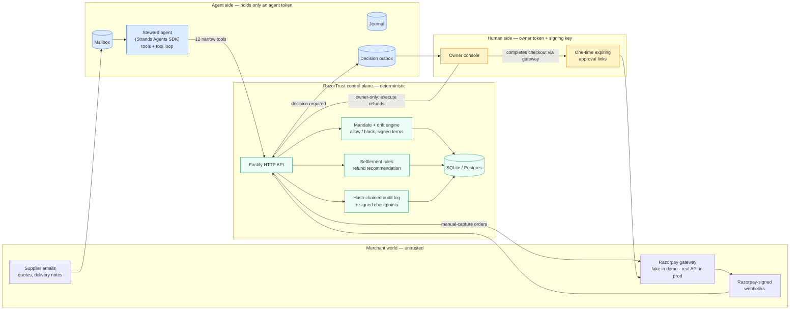
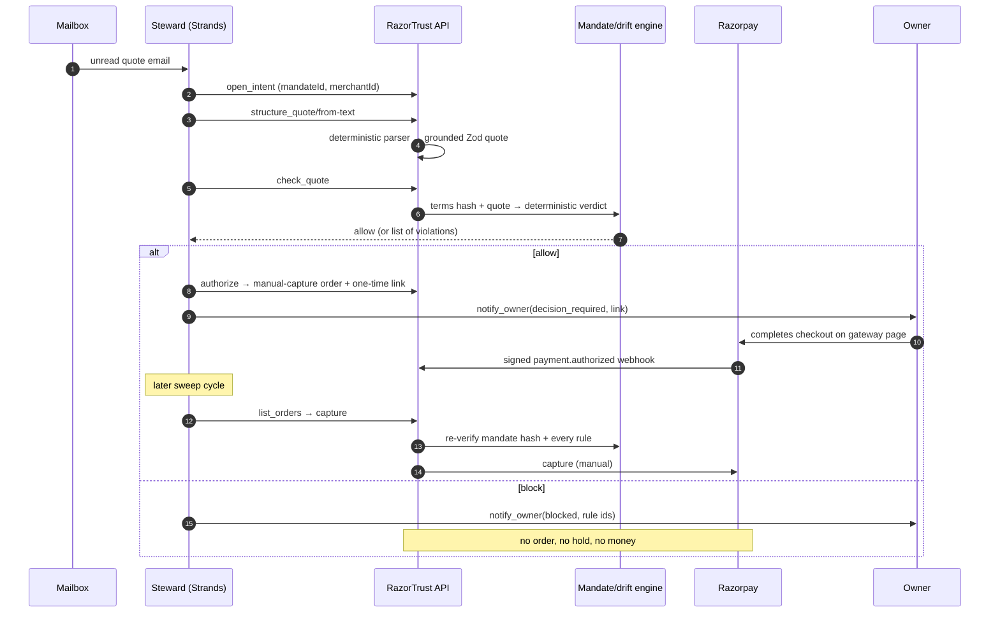
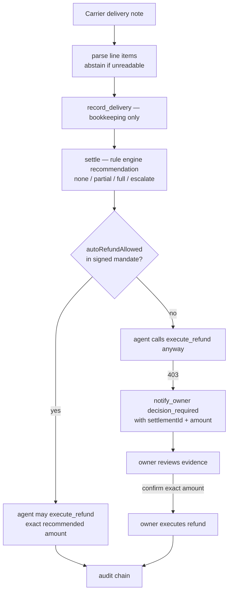
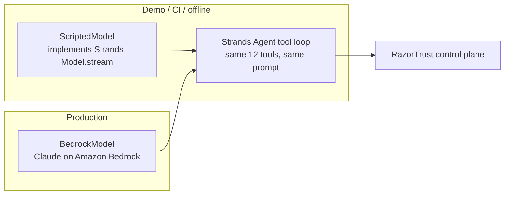

# RazorTrust + Steward — architecture

## 1. The system at a glance



The side a credential lives in decides what it can do. The agent's bearer
token can create intents, request holds, and ask for verdicts. The **owner's**
token — plus an Ed25519 private key that never enters the agent process — is
required to activate a mandate, complete checkout, and execute refunds.

## 2. A quote's journey (the money path)



Key property: the model chooses the *order of operations and reads the
results*; it never chooses the verdict. `check_quote` and capture-time
re-checks are deterministic functions of the signed mandate and the quote.

## 3. Post-delivery settlement



A recommendation never moves money. Execution is a separate, authenticated
step, capped at `captured − alreadyRefunded`, and an amount that does not
exactly match the recommendation is rejected.

## 4. Tamper-evident audit

```mermaid
flowchart LR
    E1[event 1<br/>payload canonical JSON] --> H1[hash₁ = H(prev=genesis ‖ payload)]
    H1 --> E2[event 2] --> H2[hash₂ = H(hash₁ ‖ payload₂)]
    H2 --> EN[...] --> HN[hashₙ]
    HN --> CP[checkpoint every N events<br/>Ed25519 signature of head]
    CP --> V[verify route]
    TA[out-of-band public key<br/>trust anchor] --> V
    V -->|signer mismatch / broken link| FAIL[ok: false]
```

- SQLite triggers abort any `UPDATE`/`DELETE` on audit tables.
- Each event's hash covers the canonical payload and the previous hash.
- Checkpoints are Ed25519-signed; `/v1/audit/verify` only accepts checkpoints
  signed by the configured out-of-band public key (`AUDIT_CHECKPOINT_PUBLIC_KEY_PEM`).
  A database attacker cannot forge that signature.

## 5. Strands model swap



Both models emit the same stream protocol (tool-use starts, JSON input
deltas, tool results), so behaviour under the deterministic controls is
identical; only the "which tool next" decision changes source.
